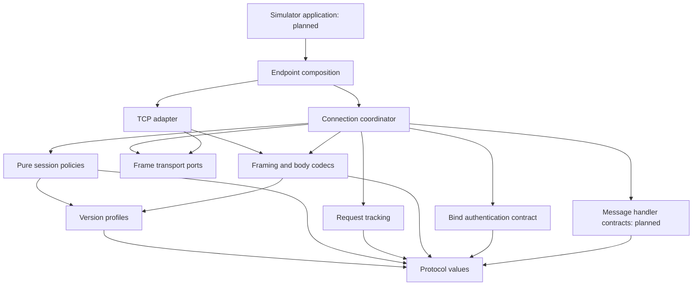

# Library contracts

Step 1 design baseline, updated through Step 11. Binding and control endpoint
APIs are compiled; application messaging remains planned. Executed contracts are
documented in [FRAMING.md](FRAMING.md), [FIELDS.md](FIELDS.md),
[COMMANDS.md](COMMANDS.md), [MESSAGES.md](MESSAGES.md),
[SESSIONS.md](SESSIONS.md), [REQUESTS.md](REQUESTS.md),
[TRANSPORT.md](TRANSPORT.md), and [ENDPOINTS.md](ENDPOINTS.md). Refine future API
names through tests while preserving the behavior or documenting an intentional change.

## Scope and decisions

Provide an ESME client and a message-center server, sharing protocol values,
codecs, and session policies. Target Java 21 and SMPP 3.4/5.0. Keep one library
artifact initially, with no runtime dependencies until a concrete requirement
justifies one. Simulator tooling becomes a separate application subproject.

Use one asynchronous request mechanism. A caller may wait on its result; a future
blocking convenience API must delegate to the same mechanism. Expose focused
capabilities for submission, delivery, message management, and broadcast rather
than requiring every session or handler to implement every operation.

Connection role and SMPP role are distinct. Normal ESME binding opens TCP from
client to server. Outbind additionally needs an ESME listener and a message-center
connector; it sends the notification and subsequent bind on that connection.
Keep these entry points explicit when implementing outbind in Step 14.[^1][^2]

The [protocol inventory](PROTOCOL.md) owns wire and role rules. The
[workload criteria](WORKLOADS.md) define benchmark inputs. Both the production
endpoints and simulators must use these contracts.

## Client and server binding

[Endpoint contracts](ENDPOINTS.md) contain the implemented API and runnable client
and server examples. The examples compile separately from the production library
and remain outside its binary, source and Javadoc archives.

`SmppClient.connect(config)` completes after a positive bind satisfying the
configured version policy. `connectAttempt(config)` exposes cancellation of that
same connection/bind workflow before a `BoundSession` exists. Its result uses the
same protected readiness stage; cancelling a derived future only changes that
observation. A failed or expired bind closes its connection, and reconnect never
replays outstanding requests.

`SmppServer` receives listener/version configuration, endpoint resource limits,
a focused `BindAuthenticator` and a bound-session notification callback. Supplied
executors are used only for authentication invocation and remain caller-owned.
Authentication timeout cannot release capacity still occupied by blocked
application code. The server's connection and callback bounds remain independent.

A `BoundSession` exposes connection/version/bind metadata, `enquireLink`, `unbind`,
closure and termination observation. Both roles bind RX, TX and TRX under 3.4 and
5.0. Each control send rechecks current state. User callbacks and future publication
run outside socket progress and coordinator locks.

## Planned messaging application contracts

Step 12 connects submission, delivery and data-message handlers. Focused sender
capabilities will reflect the negotiated profile, bind role, local implementation
and current state. A catalogue permission or existing codec alone does not expose
a usable message service.

An application owns storage and acceptance policy. A durable handler completes
acceptance after its required storage succeeds; a simulator may accept in memory.
Acknowledging an incoming delivery means accepting that PDU, independently of
handset delivery or a later receipt for another submitted message. Optional query,
replacement, cancellation, multiple-destination and broadcast services retain
separate contracts as their features arrive.

An absent handler never implies successful acceptance. The current binding-only
endpoints validate available message formats and reply negatively when a service
is unavailable; invalid state/direction and unknown commands have distinct error
responses documented in [ENDPOINTS.md](ENDPOINTS.md). They expose no successful
submission or delivery capability until those application services are implemented.

## Requests, results, and cancellation

| Contract | Decision |
| --- | --- |
| Request identity | The connection-owned request window assigns sequence numbers; applications provide message data, not manually reused sequence keys. |
| Correlation | Match session generation, local request sequence, and expected response command. Incoming peer requests use a separate namespace. |
| Terminal outcome | Exactly one of peer response, local failure, cancellation, or deadline expiry wins. Late responses cannot complete a newer request. |
| Peer rejection | Return the typed operation response with its numeric status and permitted body/TLVs, preserving unknown statuses. A correlated `generic_nack` uses the distinct `PeerNackException` because it has no operation-specific response body. It is a known peer outcome. |
| Local failure | Complete exceptionally with structured reason, operation, session identity, and transmission certainty. |
| Cancellation | `RequestHandle.cancel()` competes for the terminal outcome; it never sends `cancel_sm` or withdraws an already transmitted message. |
| Result observation | `RequestHandle<R>.result()` exposes `CompletionStage<Pdu<R>>` without allowing callers to complete the library's internal result. Use the handle to cancel; terminal-state observation does not wait for application notification. |
| Blocking wait | Waiting or interrupting a caller's `get()` does not automatically cancel its protocol request. |
| Retries | No automatic message replay. Reconnect creates a new session and does not inherit outstanding request identifiers. |

Use transmission certainty values such as `NOT_SENT` and `MAY_HAVE_BEEN_SENT` on
local failures. A partial or completed local write cannot prove peer acceptance.
A positive or negative peer response is a known protocol outcome; handset delivery
and later receipt state remain separate. Do not describe timeout or cancellation
as guaranteed message rejection.

Step 9 allocates sequence numbers monotonically from 1 through `0x7fffffff`
within a unique connection generation. It never wraps or reuses a number, even
after completion. Exhaustion rejects admission; establish a new connection
instead of resetting the existing window. Verify same-valued sequence numbers
can coexist in opposite directions.[^1][^2]

Default admission is fail-fast when the outbound request window or byte bound is
full. A waiting-admission option, if added, must have its own bounded queue and
consume the same overall deadline. No public method hides an unbounded queue.

## Deadlines and callback execution

The request timeout starts at API invocation and includes validation/admission,
writing, and waiting for a response. The terminal transition uses monotonic time.
Endpoint configuration controls TCP connection, binding/authentication, manual
control requests and shutdown deadlines. TLS, message-handler completion and
scheduled keepalive deadlines will be added with those features.

The implemented defaults are 5 seconds for TCP connection and 10 seconds for
binding, manual requests and abort cleanup. These configurable values are library
policy, not protocol-mandated timings. Ten seconds remains the proposed initial
message-handler deadline for Step 12; workload profiles may override it.

Bind authentication returns asynchronous typed decisions. Message handlers will
use the same execution boundary: application work and future notifications run
outside transport read/write progress. The internal terminal
state must settle even when application notification is delayed. Bound dispatch
queues and concurrency; define overload results before accepting callback work.
Reserve capacity for control responses and shutdown.

The planned message-service contract begins ordinary callbacks in receive order while
allowing asynchronous processing to overlap. The initial response scheduler
preserves peer-request order for these callbacks, with bounded pending replies
and handler deadlines. Control replies use separate capacity so one slow message
cannot prevent an `enquire_link` response. Correlation accepts out-of-order peer
responses even though our default emission policy is ordered.

Applications must use an appropriate executor for expensive dependent future
actions and cooperate with cancellation. The library cannot forcibly stop
arbitrary application code. Document this limitation without blocking socket
cleanup or allowing callback work to grow without bound.

## Values, fields, and version handling

Public protocol values are immutable. Defensively copy mutable byte arrays and
collections at the public boundary; expose no mutable internal buffers. Decide
binary equality explicitly. Keep payload octets and `data_coding` independent of
text conversion; no implicit encoding or segmentation occurs during sending.

Preserve TLVs as an ordered collection of tag/value entries, including repeated
tags. A map would lose repeated broadcast areas and other permitted multiplicity.
Typed access applies only to supported command/profile contexts. Incoming unknown
or unexpected well-formed TLVs are retained as raw information and ignored
semantically; malformed lengths still fail validation.[^1][^2]

Require an explicit requested version and accepted-version set. The server
advertises its implemented version in successful bind responses. Keep requested
version, raw advertisement, effective profile, and usable TLVs separate.

| Client request / advertisement | Default library policy |
| --- | --- |
| 3.4 / 3.4 or 5.0 | Use the implemented 3.4 profile; do not enable 5.0 operations. |
| 5.0 / 5.0 | Use implemented 5.0 capabilities, subject to bind role. |
| 5.0 / 3.4 | Fail the requested-version requirement and close; no automatic rebind. |
| Either / missing | Retain the requested version as metadata; expose only common 3.4-compatible non-TLV operations/field values and reject sends requiring additional capabilities. |
| Either / unrecognized value | Preserve the advertisement and fail with an explicit unsupported-peer-version outcome. |

Missing advertisement does not prove full version support. A caller requiring
verified capabilities can configure binding to fail in that case. Compatibility
adjustments require named rules, scope, and test evidence; they never silently
change credentials or resubmit messages. The missing-TLV default follows the
specification's backward-compatibility guidance.[^1]

Validate outgoing data against profile, command, role, state, and configured bounds
before reserving network work. Decode incoming raw values independently from the
decision to invoke an application handler. Field and capability checks must not
be scattered across socket loops.

## Resource ownership and observability

Client owners track their connections; server owners track the listener and
accepted sessions. A session owns its connection and pending protocol state.
Closing a session does not close a shared application executor or its owner.
Internally created executors belong to the endpoint; supplied executors belong
to the caller unless ownership is explicitly transferred.

`shutdown(grace)` stops new work, drains within the deadline, unbinds eligible
sessions, and then closes connections. `close()` is the idempotent abort fallback:
stop I/O, settle internal pending outcomes, and request owned-executor shutdown.
It does not wait indefinitely for application code. A separate termination result
reports completed cleanup or the specific tasks that exceeded the shutdown bound.
The implementation must document when these asynchronous notifications can finish.

Set explicit bounds for accepted and connecting sockets, requests, queued bytes,
frame size, handler work, reply buffering, and optional receipt/reassembly state.
The implemented default maximum accepted PDU is 1 MiB, configurable above the header
minimum; this is an allocation guard, not a change to protocol field limits.

Current endpoint APIs expose session metadata and bounded termination snapshots.
Additional metrics and observer contracts remain planned. Diagnostics include
operation, sequence, session, state and status where available.
Credentials and message bodies stay out of ordinary logs, exceptions, and generated
`toString()` output. Metrics must not require per-message retention.

## Responsibility and dependency review

Composition constructs concrete adapters. The connection coordinator consumes
frame transport ports and combines the independent codec, session-policy and
request owners. Pure session policies decide permissions without codecs, clocks,
request maps or sockets. Request tracking owns correlation and deadlines without
session rules or byte parsing. Application implementations of handler contracts
remain outside the library. Dependencies never point back to simulator tooling.

| Responsibility | SOLID design obligation |
| --- | --- |
| Protocol values and field codecs | Keep value invariants and wire translation cohesive; exclude networking and application policy. |
| Profiles and codec dispatch | Add supported commands at explicit registration/profile boundaries; reject duplicate registrations. |
| State and request tracking | Separate permission decisions from correlation, deadlines, and terminal outcomes. |
| Transport and test adapters | Preserve ordering, ownership, failure, and close contracts across implementations. |
| Handler and capability interfaces | Serve actual consumers without unrelated mandatory callbacks or unsupported stubs. |
| Endpoint composition | Construct variable infrastructure at the boundary; keep session policies independent of concrete adapters. |
| Simulators | Separate schedules, response policies, counters, and report output; consume the public API. |

The diagram distinguishes implemented binding/control layers from planned
message services and simulator tooling. It does not establish SOLID compliance for the future types. When code
arrives, review every affected type under [the SOLID policy](SOLID.md) and record
real [TDD evidence](TDD.md).

The first scenarios and acceptance evidence are in [the test plan](TEST_PLAN.md).
The first [TCP experiment](TRANSPORT.md) uses JDK sockets and Java 21 virtual
threads. TLS and broader lifecycle hardening remain Step 17. External performance
targets and provider-specific exceptions remain open until supplied or measured.

## Sources

[^1]: SMS Forum. [SMPP 5.0](https://smpp.org/SMPP_v5.pdf), §§2.4–2.8, 2.11, 4.1.1.7, 4.7.24, and 4.8, 19 February 2003. Protocol facts inform the contracts; API names, deadlines, and resource policies are project decisions.
[^2]: SMPP Developers Forum. [SMPP 3.4, Issue 1.2](https://smpp.org/SMPP_v3_4_Issue1_2.pdf), §§2.3, 2.5–2.7, 3.3–3.4, 4.1.7, and 5, 12 October 1999.
