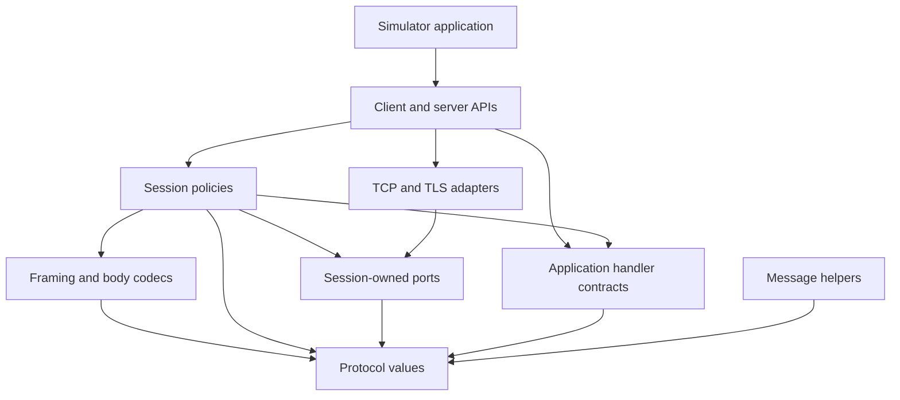

# Library contracts

Step 1 design baseline, updated through Step 7. The endpoint usage examples below
remain design sketches. Implemented low-level APIs and executed contracts are
documented in [FRAMING.md](FRAMING.md), [FIELDS.md](FIELDS.md),
[COMMANDS.md](COMMANDS.md), and [MESSAGES.md](MESSAGES.md). Refine endpoint names
through tests while preserving
the behavior or documenting an intentional change.

## Scope and decisions

Provide an ESME client and a message-center server, sharing protocol values,
codecs, and session policies. Target Java 21 and SMPP 3.4/5.0. Keep one library
artifact initially, with no runtime dependencies until a concrete requirement
justifies one. Simulator tooling becomes a separate application subproject.

Use one asynchronous request mechanism. A caller may wait on its result; a future
blocking convenience API must delegate to the same mechanism. Expose focused
capabilities for submission, delivery, message management, and broadcast rather
than requiring every session or handler to implement every operation.

Connection role and SMPP role are distinct. Normal ESME binding opens TCP from
client to server. Outbind additionally needs an ESME listener and a message-center
connector; it sends the notification and subsequent bind on that connection.
Keep these entry points explicit when implementing outbind in Step 14.[^1][^2]

The [protocol inventory](PROTOCOL.md) owns wire and role rules. The
[workload criteria](WORKLOADS.md) define benchmark inputs. Both the production
endpoints and simulators must use these contracts.

## Client usage sketch

The application-owned `deliveryInbox` accepts an incoming delivery asynchronously.
Acknowledging it means the application accepted that PDU, not that a handset
received a different submitted message. Imports and application setup are omitted.

```java
try (SmppClient client = SmppClient.builder()
        .deliveryHandler((session, delivery) -> deliveryInbox.accept(delivery)
                .thenApply(ignored -> DeliverSmResult.acknowledged()))
        .build()) {
    ClientConfig config = ClientConfig.builder()
            .remoteAddress("127.0.0.1", 2775)
            .credentials("demo", "demo")
            .version(SmppVersion.V5_0)
            .bindMode(BindMode.TRANSCEIVER)
            .requestWindow(32)
            .build();

    try (ClientSession session = client.connect(config).toCompletableFuture().get()) {
        SubmissionSender submissions = session.submissions().orElseThrow();
        SubmitSm message = SubmitSm.builder()
                .source(Address.alphanumeric("Example"))
                .destination(Address.international("12025550101"))
                .payload(Payload.octets(0x04, new byte[] {1, 2, 3}))
                .build();

        RequestHandle<SubmitSmResponse> request = submissions.submit(
                message, RequestOptions.timeout(Duration.ofSeconds(5)));
        SubmitSmResponse response = request.result().toCompletableFuture().get();
        if (response.status().isSuccess()) {
            String messageId = response.messageId().orElseThrow();
            // Retain the peer's identifier for later delivery-receipt correlation.
        } else {
            // Handle the peer's status; a negative response is a protocol result.
        }

        session.unbind().result().toCompletableFuture().get();
    }
}
```

`connect` completes only after successful binding. A failed or expired bind closes
its connection. In the sketch, blocking `get()` is on application code; neither
network progress nor handler dispatch may depend on that thread.

`submissions()` is absent when the profile or bind role does not permit submission.
Other capability views follow the same rule. Capabilities describe protocol
permission and local implementation, not a promise that a peer will accept a
particular message. Each send rechecks current session state.

## Server usage sketch

`authenticationService` and `messageStore` are supplied by the application. They
are not library components. A durable application completes acceptance only after
its required storage operation succeeds; a simulator may deliberately accept in
memory. Keeping that decision in the handler avoids building an SMSC database
into the protocol library.

```java
try (SmppServer server = SmppServer.builder()
        .listenAddress("127.0.0.1", 2775)
        .acceptedVersions(SmppVersion.V3_4, SmppVersion.V5_0)
        .connectionLimit(100)
        .requestWindow(32)
        .authenticator(authenticationService::authenticate)
        .submissionHandler((session, submission) -> messageStore.accept(submission)
                .thenApply(SubmitSmResult::accepted))
        .build()) {
    server.start().toCompletableFuture().get();
    // The application runs until its own stop signal.
    stopSignal.toCompletableFuture().get();
    server.shutdown(Duration.ofSeconds(10)).toCompletableFuture().get();
}
```

An application receives bound-session lifecycle notifications and can retain a
session while it is active. It uses `session.deliveries()` to send `deliver_sm`
when allowed and handles the returned `RequestHandle<DeliverSmResponse>`. Incoming
`data_sm` has its own focused handler and direction-aware permissions. Optional
query, replacement, cancellation, multiple-destination, and broadcast services
have separate application contracts as their features arrive.

An absent handler does not imply successful acceptance. Fail server startup if
a configured advertised service lacks its required handler. A valid request for
an unavailable application service receives the operation-appropriate documented
negative result; an unknown command is a different protocol case. Select the
exact status per operation from the inventory before implementing that handler.

## Requests, results, and cancellation

| Contract | Decision |
| --- | --- |
| Request identity | The session assigns sequence numbers; applications provide message data, not manually reused sequence keys. |
| Correlation | Match session generation, local request sequence, and expected response command. Incoming peer requests use a separate namespace. |
| Terminal outcome | Exactly one of peer response, local failure, cancellation, or deadline expiry wins. Late responses cannot complete a newer request. |
| Peer rejection | Return the typed response with its numeric status and any permitted body/TLVs. Preserve unknown status values. |
| Local failure | Complete exceptionally with structured reason, operation, session identity, and transmission certainty. |
| Cancellation | `RequestHandle.cancel()` competes for the terminal outcome; it never sends `cancel_sm` or withdraws an already transmitted message. |
| Result observation | `result()` exposes `CompletionStage<R>` without allowing callers to complete the library's internal result. Use the handle to cancel. |
| Blocking wait | Waiting or interrupting a caller's `get()` does not automatically cancel its protocol request. |
| Retries | No automatic message replay. Reconnect creates a new session and does not inherit outstanding request identifiers. |

Use transmission certainty values such as `NOT_SENT` and `MAY_HAVE_BEEN_SENT` on
local failures. A partial or completed local write cannot prove peer acceptance.
A positive or negative peer response is a known protocol outcome; handset delivery
and later receipt state remain separate. Do not describe timeout or cancellation
as guaranteed message rejection.

Allocate sequence numbers monotonically within the permitted range. Do not reuse
an active number. For the default policy, start a new session before exhausting
the range; a wrapping policy would additionally need protection against stale
responses and explicit tests. Verify same-valued sequence numbers can coexist in
opposite directions.[^1][^2]

Default admission is fail-fast when the outbound request window or byte bound is
full. A waiting-admission option, if added, must have its own bounded queue and
consume the same overall deadline. No public method hides an unbounded queue.

## Deadlines and callback execution

The request timeout starts at API invocation and includes validation/admission,
writing, and waiting for a response. The terminal transition uses monotonic time.
Separate configuration controls connecting, TLS, binding/authentication, inbound
handler completion, keepalive response, and graceful shutdown deadlines.

As an initial implementation baseline, use 5 seconds for TCP connection, 10 seconds
for binding and ordinary requests, and 10 seconds for inbound handler completion.
All values are configurable, validated, and documented as library policy, not
protocol-mandated timings. Workload profiles override them explicitly.

Handlers return asynchronous typed decisions. Dispatch application handlers and
future notifications outside transport read/write progress. The internal terminal
state must settle even when application notification is delayed. Bound dispatch
queues and concurrency; define overload results before accepting callback work.
Reserve capacity for control responses and shutdown.

For a given session, begin ordinary message callbacks in receive order while
allowing asynchronous processing to overlap. The initial response scheduler
preserves peer-request order for these callbacks, with bounded pending replies
and handler deadlines. Control replies use separate capacity so one slow message
cannot prevent an `enquire_link` response. Correlation accepts out-of-order peer
responses even though our default emission policy is ordered.

Applications must use an appropriate executor for expensive dependent future
actions and cooperate with cancellation. The library cannot forcibly stop
arbitrary application code. Document this limitation without blocking socket
cleanup or allowing callback work to grow without bound.

## Values, fields, and version handling

Public protocol values are immutable. Defensively copy mutable byte arrays and
collections at the public boundary; expose no mutable internal buffers. Decide
binary equality explicitly. Keep payload octets and `data_coding` independent of
text conversion; no implicit encoding or segmentation occurs during sending.

Preserve TLVs as an ordered collection of tag/value entries, including repeated
tags. A map would lose repeated broadcast areas and other permitted multiplicity.
Typed access applies only to supported command/profile contexts. Incoming unknown
or unexpected well-formed TLVs are retained as raw information and ignored
semantically; malformed lengths still fail validation.[^1][^2]

Require an explicit requested version and accepted-version set. The server
advertises its implemented version in successful bind responses. Keep requested
version, raw advertisement, effective profile, and usable TLVs separate.

| Client request / advertisement | Default library policy |
| --- | --- |
| 3.4 / 3.4 or 5.0 | Use the implemented 3.4 profile; do not enable 5.0 operations. |
| 5.0 / 5.0 | Use implemented 5.0 capabilities, subject to bind role. |
| 5.0 / 3.4 | Fail the requested-version requirement and close; no automatic rebind. |
| Either / missing | Retain the requested version as metadata; expose only common 3.4-compatible non-TLV operations/field values and reject sends requiring additional capabilities. |
| Either / unrecognized value | Preserve the advertisement and fail with an explicit unsupported-peer-version outcome. |

Missing advertisement does not prove full version support. A caller requiring
verified capabilities can configure binding to fail in that case. Compatibility
adjustments require named rules, scope, and test evidence; they never silently
change credentials or resubmit messages. The missing-TLV default follows the
specification's backward-compatibility guidance.[^1]

Validate outgoing data against profile, command, role, state, and configured bounds
before reserving network work. Decode incoming raw values independently from the
decision to invoke an application handler. Field and capability checks must not
be scattered across socket loops.

## Resource ownership and observability

Client owners track their connections; server owners track the listener and
accepted sessions. A session owns its connection and pending protocol state.
Closing a session does not close a shared application executor or its owner.
Internally created executors belong to the endpoint; supplied executors belong
to the caller unless ownership is explicitly transferred.

`shutdown(grace)` stops new work, drains within the deadline, unbinds eligible
sessions, and then closes connections. `close()` is the idempotent abort fallback:
stop I/O, settle internal pending outcomes, and request owned-executor shutdown.
It does not wait indefinitely for application code. A separate termination result
reports completed cleanup or the specific tasks that exceeded the shutdown bound.
The implementation must document when these asynchronous notifications can finish.

Set explicit bounds for accepted and connecting sockets, requests, queued bytes,
frame size, handler work, reply buffering, and optional receipt/reassembly state.
The proposed initial maximum accepted PDU is 1 MiB, configurable above the header
minimum; this is an allocation guard, not a change to protocol field limits.

Expose read-only counters and lifecycle events through small observer contracts.
Diagnostics include operation, sequence, session, state, and status where available.
Credentials and message bodies stay out of ordinary logs, exceptions, and generated
`toString()` output. Metrics must not require per-message retention.

## Responsibility and dependency review



Composition constructs concrete adapters. Session policies depend on the ports
they consume. Application implementations of handler contracts are outside the
library. Dependencies never point back from the library to simulator tooling.

| Responsibility | SOLID design obligation |
| --- | --- |
| Protocol values and field codecs | Keep value invariants and wire translation cohesive; exclude networking and application policy. |
| Profiles and codec dispatch | Add supported commands at explicit registration/profile boundaries; reject duplicate registrations. |
| State and request tracking | Separate permission decisions from correlation, deadlines, and terminal outcomes. |
| Transport and test adapters | Preserve ordering, ownership, failure, and close contracts across implementations. |
| Handler and capability interfaces | Serve actual consumers without unrelated mandatory callbacks or unsupported stubs. |
| Endpoint composition | Construct variable infrastructure at the boundary; keep session policies independent of concrete adapters. |
| Simulators | Separate schedules, response policies, counters, and report output; consume the public API. |

This is a design review of proposed responsibilities. It is not a SOLID verdict
on nonexistent classes. When code arrives, review every affected type under
[the SOLID policy](SOLID.md) and record real [TDD evidence](TDD.md).

The first scenarios and acceptance evidence are in [the test plan](TEST_PLAN.md).
Transport selection remains an experiment for Step 10; external performance
targets and any provider-specific exceptions remain open until supplied or measured.

## Sources

[^1]: SMS Forum. [SMPP 5.0](https://smpp.org/SMPP_v5.pdf), §§2.4–2.8, 2.11, 4.1.1.7, 4.7.24, and 4.8, 19 February 2003. Protocol facts inform the contracts; API names, deadlines, and resource policies are project decisions.
[^2]: SMPP Developers Forum. [SMPP 3.4, Issue 1.2](https://smpp.org/SMPP_v3_4_Issue1_2.pdf), §§2.3, 2.5–2.7, 3.3–3.4, 4.1.7, and 5, 12 October 1999.
