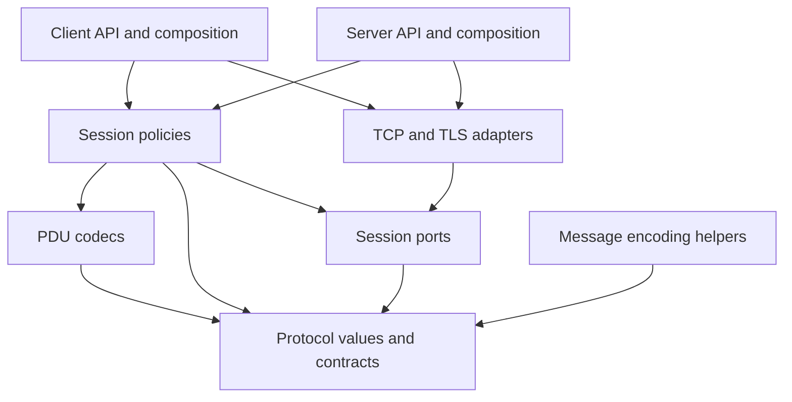

# Java SMPP library research and design

## Recommended direction

Build a Java library that supports both SMPP clients and servers, with explicit
SMPP 5.0 and 3.4 profiles. Use a shared protocol representation, codec, and session
engine, with separate client and server entry points. Keep application decisions
such as account authentication and message acceptance behind small callback
contracts. Each implementation step should include test-driven development and a
recorded SOLID review for every type it creates or changes.

Client and server simulators are required delivery tools. Introduce a runnable
pair after basic messaging, extend their scenarios with each protocol feature,
and use them to measure both endpoints under heavy load and controlled faults.

SMPP 5.0 is the latest public specification identified in the current protocol
catalogue. Retaining 3.4 is a practical interoperability requirement: Infobip's
published interface supports 3.4 and explicitly excludes 5.0, while Sinch's Cloud
SMPP interface documents 3.3 and 3.4. These are examples of provider requirements,
not a measurement of the entire market.[^1][^4][^5]

The existing development baseline is Java 21, Gradle 9.6.0, JUnit Jupiter 6.0.0,
compiler warnings treated as errors, and local Gradle caching. The source tree is
empty. No protocol implementation, SOLID architecture test, automatic review
coverage check, or interoperability result exists yet.

The recommended initial library packaging is one JAR with clear package boundaries.
Begin with JDK facilities and introduce a runtime dependency only for a concrete
requirement or a measured improvement. SOLID should keep change responsibilities
clear while preserving a small API. It should not be interpreted as a requirement
to generate an interface for every class or a module for every responsibility.
Add a separate simulator application subproject when those tools are developed;
its measurement and CLI dependencies must not become library runtime dependencies.

The enforceable working policies are in [SOLID](SOLID.md) and [TDD](TDD.md).
The [roadmap](ROADMAP.md) converts the recommendations below into small delivery
steps. Architecture names in this report are proposals to refine through tests,
not classes already implemented.

Step 1 has since established [API contracts](API.md), the
[protocol inventory](PROTOCOL.md), [TLV inventory](TLVS.md),
[test scenarios](TEST_PLAN.md), and [provisional workload criteria](WORKLOADS.md).
Use those documents for current design decisions; this report records their
research background.

Step 2 configured deterministic formatting and ArchUnit core for Jupiter tests.
Its [tooling review](reviews/0001-code-checks.md) records the selected versions,
isolated fixture results, and cache verification. Actual project architecture
rules still begin with production classes in Step 3.

## Protocol versions and compatibility

### Version targets

The public SMS Forum specification is titled **Version 5.0**, dated
19 February 2003. The 3.4 reference is **Issue 1.2**, dated 12 October 1999.
The version date and the document issue are separate identifiers.[^2][^3]

| Version or label | Evidence | Project treatment |
| --- | --- | --- |
| SMPP 5.0 | Public specification and current catalogue | Required target for both endpoint roles. |
| SMPP 3.4 | Public specification and provider requirements | Required compatibility target for both roles. |
| SMPP 3.3 | Older public specification | Optional later work driven by an identified peer. |
| SMPP 5.1 | Appears in older Oracle product documentation | No separate public standard verified; investigate a concrete peer before adding a profile. |

This distinction is supported by the specification catalogue and the referenced
provider documentation.[^1][^4][^5][^6] The assessment is current to
9 September 2026; future changes require checking the actual published standard.

Oracle's Services Gatekeeper documentation uses the label “5.1” for selected
billing and USSD functionality. Its section references for those parameters also
occur in the public 5.0 document. That is evidence of an unresolved naming
inconsistency, not sufficient evidence for another interoperable standard. The
implementation should not invent a version byte from that product label.[^6][^2]

### Meaning of support

Version support needs more detail than a successful bind. For each operation,
record whether its body can be encoded and decoded, whether it can be sent or
received in each endpoint role, which optional fields are understood, and which
behavior has an interoperability test. A peer's version does not establish that
it implements every optional service.

Maintain a conformance table with separate columns for **planned**, **codec
tested**, **session tested**, and **independently verified**. Also record unsupported
or application-provided behavior. The PICS approach is useful for making support
claims precise; the available PICS guidance explicitly calls for reporting the
parts implemented and adapting the statement to the protocol version.[^7]

The following operation families define the planned implementation scope. The
command inventory comes from the two protocol specifications.[^2][^3]

| Family | Operations | Delivery goal |
| --- | --- | --- |
| Session | Three bind modes, unbind, enquire link, generic nack | Shared core with role-specific permissions. |
| Point-to-point messaging | `submit_sm`, `deliver_sm`, `data_sm` | Client and server requests, responses, and callbacks. |
| Message management | `query_sm`, `replace_sm`, `cancel_sm` | Typed application hooks and protocol responses. |
| Multiple destinations | `submit_multi` | Explicit per-destination results. |
| Notifications | `outbind`, `alert_notification` | Correct one-way handling and application events. |
| Broadcast | `broadcast_sm`, `query_broadcast_sm`, `cancel_broadcast_sm` | 5.0 codecs, handlers, responses, and tests. |

Broadcast, additional delivery-receipt options, congestion information, and
expanded routing/billing/USSD parameters are material 5.0 additions. Their
presence is a reason to model a protocol profile explicitly rather than treating
5.0 as a different bind number on an otherwise unchanged client.[^8]

The server component should implement an SMPP endpoint and expose application
hooks. A durable SMS queue, billing engine, subscriber database, delivery network,
and physical cell-broadcast service belong to applications using that endpoint.
A demo handler may acknowledge a test message, but that result must not be
described as delivery to a handset or a complete SMSC service.

### Version handling at session boundaries

The specifications identify the bind version values as `0x34` and `0x50`.
The 5.0 compatibility rules also address unrecognized commands and TLVs, and
warn against assuming TLV support when the peer omits its bind-response version
advertisement.[^2]

Recommended policy:

1. Make the requested version explicit in client configuration and accepted
   versions explicit in server configuration.
2. Keep requested version, raw peer advertisement, and effective capabilities as
   separate facts. A numeric minimum of two version values is not a substitute
   for evaluating an operation's availability.
3. Require the effective capabilities to respect the selected profile, bind mode,
   local implementation, and application handler availability.
4. Define conservative behavior for a missing version advertisement. Any known
   provider compatibility adjustment must be named, narrowly scoped, and tested.
5. Define downgrade behavior independently of authentication and message retries.
   A rejected bind should not trigger arbitrary retries with changed credentials
   or message resubmission.
6. Preserve unknown, well-formed optional data for inspection while keeping
   unsupported semantics out of application decisions. Invalid framing still
   needs a bounded, deterministic error path.

These are proposed library policies. They require a version/role decision table
and test vectors before implementation. The raw version advertisement must remain
available for diagnostics so a compatibility decision can be explained.

## Lessons from the reference projects

Cloudhopper documents client and server support, synchronous and asynchronous
requests, request windows, timeout handling, and support for most of 5.0. Its
feature list is a useful source of operational scenarios, but it is not a claim
of complete 5.0 conformance.[^9]

Its shared `SmppSession` interface demonstrates that common behavior can serve
both endpoints. That interface also exposes several operational concerns,
including the request window and counters. For a smaller API, applications can
instead receive focused request, delivery, lifecycle, and diagnostic views.[^10]

The `DefaultSmppSession` implementation coordinates channel access, protocol
translation, state, and pending requests. This report recommends dividing those
responsibilities into collaborators with explicit ownership. This is a design
choice for the new library's goals, not a comprehensive SOLID audit of
Cloudhopper.[^11]

Cloudhopper Commons contains a reusable request-window implementation with offer
timeouts, expiration, and completion behavior. It provides useful cases to test:
duplicate sequence keys, exhausted capacity, interruption, expiration, and
disconnect cleanup. A small SMPP-specific implementation can expose a narrower
contract than a general-purpose utility framework.[^12]

Cloudhopper Commons also contains mobile character-encoding utilities. Keep that
concern separate from binary PDU framing so the library can carry raw payloads
without automatically selecting a text encoding.[^13] Interoperability tests
should pin the exact reference-library version and document the commands tested.
Matching one reference implementation does not establish every standard rule.

## Proposed architecture

### Package boundaries

Start with a single Gradle module rooted at `kg.aidarbek.smpp`. Introduce packages
as behavior requires them. The following dependency direction is the proposed
baseline for architecture tests; arrows represent compile-time dependencies.

The client and server composition code may construct concrete adapters. Session
policies consume ports, and adapters implement those ports. This distinction
allows default construction to stay simple without placing socket construction
inside a state machine. Runtime calls can pass across an interface while source
dependencies still point toward the interface owner.

| Area | Responsibility | Proposed boundary rule |
| --- | --- | --- |
| `protocol` | Immutable values, command identities, version and capability descriptions | JDK value facilities only; no sockets, executors, or application frameworks. |
| `codec` | Frame parsing and command body translation | May depend on protocol values; no client/server lifecycle or storage dependencies. |
| `session.spi` | Small transport and scheduling contracts consumed by session policies | No reference to concrete adapters or session implementation classes. |
| `session` internals | State transitions, request correlation, deadlines, permissions | May use protocol, codecs, and ports; no concrete transport dependency. |
| `transport` adapters | Connection establishment, reading, writing, TLS, resource cleanup | Implement ports; no dependency on session internals or application persistence. |
| `client` and `server` | Public entry points and concrete assembly for their roles | May assemble components; neither endpoint implementation depends on the other. |
| `message` | Explicit text conversion, segmentation, and receipt helpers | Depends on protocol values; usable independently of a live connection. |

Tests should enforce the exact allowed edges and reject cycles. Package rules
must distinguish `session.spi` from session internals; treating all packages with
the same prefix as one undifferentiated layer would obscure that boundary.

### Implementation mapping through Step 10

The package table above records the original research proposal. Implementation
has separated its broad session responsibility: `session` now contains pure
state, permission and version decisions; `request` contains bounded correlation,
deadlines and terminal notification. The future connection coordinator will
compose these with codecs and frame transport ports. It must not move parsing or
socket ownership back into the pure state machine. The current
[API dependency diagram](API.md) and [architecture tests](TEST_PLAN.md) describe
this refined boundary. Step 10 places frame ports in the independent `spi`
package and their JDK adapters in `transport`, replacing the earlier proposed
`session.spi` nesting. Ports have no socket or codec dependency; concrete
adapters cannot depend on request tracking, state policies or endpoint code.
Remaining package names are established in their own steps.

### Candidate responsibilities

Class names below are sketches. They should be kept, combined, or renamed based
on observed cohesion and the first tests, not generated as a mandatory class list.

| Candidate | Single responsibility | Important contract |
| --- | --- | --- |
| `PduHeader` | Represent validated header information | Stable values and explicit unsigned-field handling. |
| `FrameDecoder` | Turn a byte stream into bounded complete frames | Consistent handling of partial input and invalid lengths. |
| `PduCodec` | Dispatch body encoding and decoding | A clear result for recognized, unsupported, and malformed content. |
| `ProtocolProfile` | Describe version-specific capabilities and validation | Same capability terminology for both endpoint roles. |
| `SessionStateMachine` | Decide valid protocol state transitions | Decisions testable without a socket or wall-clock delay. |
| `RequestWindow` | Own outstanding request correlation and capacity | Exactly one terminal completion and release of each occupied slot. |
| `SessionEngine` | Coordinate the session collaborators | Explicit lifecycle without duplicating their internal policies. |
| `BindAuthenticator` | Delegate server authentication decisions | Bounded completion, explicit accept/reject result, no credential logging. |
| Request handlers | Delegate application decisions for supported operations | Typed results, error mapping, and callback completion behavior. |

Avoid a mutable superclass that combines header storage, body fields, network
operations, retries, logging, and application data. A small value hierarchy can
share genuine contracts. Shared encoding utilities can reuse field logic without
forcing unrelated commands into an inheritance relationship.

Extension points should cover known variation: protocol profiles, command/TLV
codecs, transport adapters, and application callbacks. A registry can map known
command identifiers to codecs. Registration must reject ambiguous duplicates and
must not permit an extension to bypass frame limits or role checks.

## Applying SOLID to this library

### Single responsibility

Martin's formulation connects responsibility to cohesive reasons for change,
including the people or requirements that cause that change.[^14] For this
library, wire-format changes, connection mechanics, application acceptance policy,
and observability requirements are useful separate change drivers.

Consider a server request. Parsing its fields, deciding whether an account may
submit it, storing it durably, and writing the response are different decisions.
A codec should not acquire a database dependency because one application needs
durability. An application handler can make that decision and return a typed
result; the session coordinates the response under its own deadline contract.

The reviewer should be able to explain the type's responsibility in a concrete
sentence. Method count alone does not decide the result. A value containing many
fields may be cohesive, while a short helper that mixes parsing with account
policy may not be. Read the tests as well: a test class that needs unrelated
infrastructure to assert a field rule often reveals a misplaced dependency.

### Open/closed

The open/closed principle seeks useful extension boundaries that preserve stable
behavior.[^15] The project already has genuine extension needs: two protocol
profiles, multiple command types, both endpoint roles, and application callbacks.

A new command codec should be registered with the codec dispatcher and tested
there. It should not require edits in every socket read loop or pending-request
algorithm. Likewise, a billing-related optional parameter should not change the
definition of a request timeout. A profile's capability table may change when a
new operation is deliberately supported; that focused change is expected.

Review the affected files and ask why each had to change. A long chain of unrelated
edits for a local extension is stronger evidence of a problem than the mere
presence of a `switch`. Closed value sets and explicit state transitions can use
switches when the change responsibility remains clear. Preserve the ability to
fix incorrect existing behavior; the principle is not a ban on maintenance.

### Liskov substitution

Liskov and Wing define subtyping through behavioral properties. A substitute must
preserve the contracts expected through the supertype, including invariants and
constraints on behavior over time.[^16] Java's compiler checks signatures, while
the project's contract tests and design review need to check the promised
semantics.

For a transport port, specify when a write is accepted, whether buffers are
copied, how ordering works, and what closure does to pending writes. Two adapters
that share a method signature but disagree about those points are not safely
interchangeable. An in-memory test double must follow the same contract so it
does not hide real transport failures.

A 3.4 session should not be exposed as an unconditional broadcaster and then
throw `UnsupportedOperationException` for every broadcast call. Represent the
available capability honestly. A generic request API can report unsupported
operations if that possibility is part of its documented contract. Run the same
applicable contract suite against every implementation, including test doubles.

### Interface segregation

Martin's discussion emphasizes keeping consumers free from unrelated interface
requirements.[^17] Different users of this library have different needs: a server
authenticator, a submission handler, a delivery consumer, and a lifecycle observer
should not need to implement one large callback object.

Expose focused interfaces where these consumers differ. A session's common
lifecycle view can be shared while submission, delivery, and broadcast behavior
are expressed through role-appropriate capabilities. Group operations when their
consumers and semantics belong together, rather than splitting every
method into a separate public interface.

Look for empty implementations, unsupported-method stubs, and callback objects
that carry many unused dependencies. Those are review signals, not automatic
proofs. The reviewer should identify the actual consumer whose needs justify each
interface and the effect of changing that interface on other consumers.

### Dependency inversion

Dependency inversion places source dependencies toward stable abstractions at
architectural boundaries.[^17] It does not require a dependency-injection
framework, and it does not prohibit using ordinary JDK value classes.

Construct the selected transport, scheduling facility, and application handlers
at the endpoint composition boundary, then pass the collaborators into the
session. A timer policy should be testable with controlled time; authentication
should be testable without a database implementation. The codec should not know
which networking library delivers its bytes.

An interface named after one vendor's concrete implementation is not necessarily
a useful abstraction. Review whether its methods describe the session's needs
and whether an alternate adapter could implement the contract without leaking
vendor concepts. Enforce the dependency direction with architecture tests and
check the runtime semantics with contract tests.

### Mandatory review and its limits

For every created or changed Java type, record all five findings, affected
contracts, actual tests, and a source-file hash. Include test helpers and nested
types. Reconcile the report with the final source inventory after formatting and
refactoring. A stale review or an unexplained omitted type must prevent claiming
the step is complete.

ArchUnit can inspect bytecode dependencies, layers, cycles, and other structural
rules. It also rejects rules that accidentally select no classes by default.[^18]
These capabilities support the proposed policy, but do not determine whether a
class has the right business responsibility or whether every temporal promise is
true. Treat complete SOLID assurance as a combination of explicit contracts,
current class review, automated structural checks, and observed behavior tests.

The review-coverage validator should check current files against recorded hashes
and type identities. Its success means that required review evidence is present
and current. The semantic review still has to be performed; a metadata checker
cannot establish the truth of a handwritten verdict.

## TDD as the implementation workflow

Kent Beck describes TDD as selecting one runnable scenario at a time, making it
pass while preserving existing tests, and improving the design before repeating
the cycle.[^19] The project policy adds explicit evidence for the observed red and
green outcomes and connects the refactoring stage to the mandatory SOLID review.

For the first protocol increment, a useful sequence is: write a fixture-based
header test, observe the missing behavior, implement only that contract, then
review names and ownership. Next, add a malformed-length scenario and repeat.
Later session work can use a controlled scheduler and a fake transport to expose
an unanswered-request timeout before implementing the timeout policy.

Both endpoint roles need tests from the beginning. A client-only test suite does
not establish server authentication or callback behavior. A loopback pair built
from the same codecs is useful for integration, but needs independent byte fixtures
and external implementation comparisons to detect shared mistakes.

JUnit Jupiter's reusable test interfaces can express contracts exercised by
several implementations.[^20] Use them where a real shared contract exists, and
keep tests focused on observable results. Do not create large inheritance trees
of test fixtures merely to avoid a few lines of setup.

TDD does not justify reporting hypothetical test history. Each change report
must identify what actually failed, why, what changed, and what passed afterward.
Pure refactoring preserves already-covered behavior; documentation changes have
document checks. Neither requires a contrived failing assertion.

## Transport and Java design choices

The recommended first transport experiment is JDK sockets with Java 21 virtual
threads behind a narrow port. Oracle's Java 21 documentation describes virtual
thread scheduling and the pinning that can occur around blocking operations
inside synchronized code.[^21] That makes the approach plausible for a simple
implementation, but actual throughput and resource use require measurement.

| Option | Potential fit | Cost or question to resolve |
| --- | --- | --- |
| JDK sockets and virtual threads | Straightforward control flow and no networking runtime dependency | Prove cancellation, write ordering, TLS deadlines, bounded queues, and Java 21 pinning behavior. |
| JDK selector-based NIO | Explicit event loop with JDK-only deployment | More state management for partial reads/writes and TLS integration. |
| Netty adapter | Established channel pipeline and asynchronous networking model | Additional dependency and buffer/lifecycle contracts; isolate these from the public API. |

The Netty option is based on its documented event-driven channel and pipeline
model.[^22] The comparison is an engineering assessment for this project, not a
benchmark result. Implement one transport first; add an alternative only after
an identified need and a shared contract suite exist.

Use an asynchronous request core with a carefully defined blocking convenience
wrapper if the API requires both styles. Avoid two independent request engines.
Document whether a request deadline includes admission, writing, and response
waiting, and expose which outcome is known when a timeout happens.

Request tracking, outbound bytes, accepted connections, and application callback
work all need explicit bounds. A lightweight thread implementation does not
create unlimited SMSC capacity. Use monotonic time for elapsed deadlines and a
separate wall clock for timestamps. Define ownership of supplied executors and
make shutdown idempotent.

Prefer immutable protocol values with deliberate ownership of arrays and buffers.
Keep raw payload access available and make text encoding a separate choice.
Choose equality semantics deliberately for binary values. Public error types
should preserve protocol status and request context while avoiding credentials
and message bodies in routine diagnostics.

## Verification and development speed

### Tests that provide different evidence

| Check | Evidence provided | Important limit |
| --- | --- | --- |
| Compiler warnings | Type and compiler-detectable issues | Does not evaluate design responsibilities. |
| Deterministic formatter | Consistent layout | Does not establish behavior or SOLID. |
| Architecture tests | Declared dependency and cycle rules | Rules need meaningful scope and selected classes. |
| Contract tests | Promised behavior of substitutable implementations | Cover the defined scenarios, not every possible execution. |
| Wire fixtures | Agreement with independently specified bytes | Need separate cases per version and command. |
| Session integration tests | Role, timing, and lifecycle interaction | Same-library peers may share the same defect. |
| Interoperability tests | Behavior with a particular independent peer | Evidence is limited to that peer, version, and feature set. |
| Load and soak tests | Capacity, latency, and resource behavior under a stated workload | Results do not generalize to unstated workloads. |

Spotless is a reasonable candidate for deterministic formatting; its Gradle
integration provides check/apply tasks and documents configuration-cache support.
It belongs in development tooling, not runtime dependencies.[^23] Keep the current
four-space convention by selecting a compatible formatter style before enabling
the check.

SpotBugs is an optional later defect-analysis tool. Its documented purpose is
finding bytecode bug patterns; it should not be advertised as a SOLID verifier.[^24]
Choose additional checks based on defects they can detect and their maintenance
cost. A coverage percentage alone is not a release criterion.

### Cache-compatible checks

The existing build already enables local task-output and configuration caching.
New architecture tests should run through the test task. A custom review-evidence
validator needs declared source, review, and policy inputs and a deterministic
result. Avoid querying an undeclared Git working tree during a cached task or
reading project objects at task execution time in incompatible ways.[^25]

During TDD, changed test or source inputs should cause relevant verification to
run again. Distinguish a fresh execution from a reused green result in the change
report. Use intentional cache bypass only when fresh execution is necessary to
resolve a question. Keep normal incremental builds as the daily workflow.

Measure build performance separately from runtime performance. Build measurements
should include an unchanged build, a small source edit, a focused test, and a
fresh output restoration. Runtime measurements should report connection count,
window size, payload mix, throughput, latency, allocation, heap, and failures.
Set numerical targets once the expected workload is known.

## Client and server simulators

Provide independently runnable client and server modes that use the public
library API and can connect to other implementations. Start with connection and
bind configuration, submission/delivery traffic, response delays, throttling,
disconnects, and basic accounting. Add ramps, bursts, soak runs, connection churn,
payload mixes, TLS, and 5.0 scenarios as the corresponding features arrive.
The detailed requirements are in [the simulator design](SIMULATORS.md).

Support arrival-rate and fixed-concurrency workloads. Gatling's workload guidance
distinguishes controlling new arrivals from controlling concurrent work.[^26]
For this project, both modes must honor the SMPP request window and bounded
generator resources. Count missed scheduled arrivals and admission rejections
instead of silently reducing load when the target slows down.

Measure throughput and latency with an explicit population: scheduled arrivals,
admitted requests, actual writes, terminal results, and successful outcomes.
Record schedule delay and schedule-to-completion time alongside request latency.
HdrHistogram documents configurable precision, interval recording, and the
latency-sampling problem caused by missing requests during stalls.[^27] It is a
candidate tooling dependency, subject to compatibility checks before adoption.

Use separate processes first and separate hosts when one machine obscures the
bottleneck. Report both generator and target resource use, configuration, source
revisions, warmup, measurement duration, drain results, and fault settings.
JDK Flight Recorder provides observations useful for investigating CPU, allocation,
locks, and socket delays, with overhead depending on its configuration.[^28]
Do not infer library capacity when the generator is saturated.

Apply TDD to pacing, bounds, counters, fault policies, and report calculations.
Use deterministic fixtures before performance measurements. Review all simulator
types for SOLID, including test helpers. Keep load scheduling, response policy,
metrics, and report formatting independent where their change responsibilities
differ. Load tests run explicitly and always produce fresh measurements; cached
compilation and deterministic tests still support fast development.

Two in-house simulators provide useful stress evidence but can share a protocol
defect. Independent peers and specification-derived fixtures remain necessary.
Numerical pass criteria require an agreed workload and environment; no capacity
result exists at the planning stage.

## Delivery risks and decision points

The main scope risk is describing early messaging support as complete 5.0 support.
Keep the feature matrix visible and reserve a complete-support claim for the
specified operations and role behaviors that have evidence. Broadcast support
requires real codecs and handler contracts even when a production broadcast
backend is supplied by an application.

The main design risk is a session coordinator accumulating every concern. Review
its dependencies as each feature arrives. A class that only forwards every call
can also be unnecessary; splitting code is useful only when it clarifies an
actual responsibility or contract.

The main reliability risks are ambiguous submission outcomes, resource leaks,
and unbounded work during slow-peer or callback failures. Plan explicit terminal
outcomes, bounds, and shutdown tests. Automatic reconnect and resubmission need
separate policies because loss of an acknowledgement does not establish that a
message was rejected.

The remaining product decisions are workload targets, the initial transport,
public API shape, provider compatibility profiles, and application responsibilities
for durable acceptance. Both endpoint roles, both simulators, SOLID review, TDD,
and support for the latest verified public SMPP version are established
requirements. Resolve the remaining choices one small step at a time.

## Sources

[^1]: Melrose Labs / smpp.org. [SMPP specification catalogue](https://smpp.org/), “SMPP Specifications,” accessed 9 September 2026.
[^2]: SMS Forum. [Short Message Peer-to-Peer Protocol Specification, Version 5.0](https://smpp.org/SMPP_v5.pdf), 19 February 2003; version history p. 17, compatibility §§2.11.1–2.11.2, operations §4, interface version §4.7.13, billing §4.8.4.3, USSD §4.8.4.64. Public mirror hosted by smpp.org.
[^3]: SMPP Developers Forum. [SMPP Protocol Specification v3.4, Issue 1.2](https://smpp.org/SMPP_v3_4_Issue1_2.pdf), 12 October 1999, operations §4 and parameters §5. Public mirror hosted by smpp.org.
[^4]: Infobip. [SMPP specification](https://www.infobip.com/docs/essentials/api-essentials/smpp-specification), current provider documentation, accessed 9 September 2026.
[^5]: Sinch. [Cloud SMPP](https://developers.sinch.com/docs/sms/other/sms-other-cloud-smpp), connection configuration and supported commands, accessed 9 September 2026.
[^6]: Oracle. [Native SMPP](https://docs.oracle.com/cd/E50778_01/doc.60/e50761/com_native_smpp.htm), Services Gatekeeper 6.0 documentation, “Billing Identification,” “USSD Support,” and “SmppVersion”; accessed 9 September 2026. Its “5.1” terminology conflicts with the public specification catalogue.
[^7]: Melrose Labs / smpp.org. [SMPP PICS](https://smpp.org/smpp-pics.html), conformance-statement guidance, accessed 9 September 2026.
[^8]: Melrose Labs / smpp.org. [SMPP v5 Overview](https://smpp.org/smpp-v5.html), feature differences, accessed 9 September 2026.
[^9]: Fizzed. [Cloudhopper SMPP README](https://github.com/fizzed/cloudhopper-smpp), `master` branch, accessed 9 September 2026.
[^10]: Cloudhopper / Twitter / Fizzed. [SmppSession.java](https://github.com/fizzed/cloudhopper-smpp/blob/master/src/main/java/com/cloudhopper/smpp/SmppSession.java), `master` branch, accessed 9 September 2026.
[^11]: Cloudhopper / Twitter / Fizzed. [DefaultSmppSession.java](https://github.com/fizzed/cloudhopper-smpp/blob/master/src/main/java/com/cloudhopper/smpp/impl/DefaultSmppSession.java), `master` branch, accessed 9 September 2026.
[^12]: Cloudhopper / Twitter. [Window.java](https://github.com/twitter/cloudhopper-commons/blob/master/ch-commons-util/src/main/java/com/cloudhopper/commons/util/windowing/Window.java), `master` branch, accessed 9 September 2026.
[^13]: Twitter. [Cloudhopper Commons README](https://github.com/twitter/cloudhopper-commons), `master` branch, accessed 9 September 2026.
[^14]: Robert C. Martin. [The Single Responsibility Principle](https://blog.cleancoder.com/uncle-bob/2014/05/08/SingleReponsibilityPrinciple.html), 8 May 2014.
[^15]: Robert C. Martin. [The Open Closed Principle](https://blog.cleancoder.com/uncle-bob/2014/05/12/TheOpenClosedPrinciple.html), 12 May 2014.
[^16]: Barbara H. Liskov and Jeannette M. Wing. [A Behavioral Notion of Subtyping](https://www.cs.cmu.edu/~wing/publications/LiskovWing94.pdf), ACM Transactions on Programming Languages and Systems 16(6), pp. 1811–1841, November 1994.
[^17]: Robert C. Martin. [Solid Relevance](https://blog.cleancoder.com/uncle-bob/2020/10/18/Solid-Relevance.html), 18 October 2020; interface segregation and dependency inversion discussions.
[^18]: TNG Technology Consulting / ArchUnit contributors. [ArchUnit User Guide](https://www.archunit.org/userguide/html/000_Index.html), architecture rules, JUnit integration, and §10.4, accessed 9 September 2026.
[^19]: Kent Beck. [Canon TDD](https://newsletter.kentbeck.com/p/canon-tdd), 11 December 2023.
[^20]: JUnit team. [Test Interfaces and Default Methods](https://docs.junit.org/6.0.0/writing-tests/test-interfaces-and-default-methods.html), JUnit 6.0.0 documentation, accessed 9 September 2026.
[^21]: Oracle. [Virtual Threads](https://docs.oracle.com/en/java/javase/21/core/virtual-threads.html), Java 21 Core Libraries documentation, scheduling and pinning, accessed 9 September 2026.
[^22]: Netty project. [User guide for 4.x](https://netty.io/wiki/user-guide-for-4.x.html), channel pipeline and handler model, accessed 9 September 2026.
[^23]: DiffPlug / Spotless contributors. [Spotless](https://github.com/diffplug/spotless) and [Gradle plugin documentation](https://github.com/diffplug/spotless/tree/main/plugin-gradle), accessed 9 September 2026.
[^24]: SpotBugs contributors. [Introduction](https://spotbugs.readthedocs.io/en/stable/introduction.html), documentation accessed 9 September 2026.
[^25]: Gradle. [Configuration Cache Requirements](https://docs.gradle.org/9.6.0/userguide/configuration_cache_requirements.html), version 9.6.0, accessed 9 September 2026.
[^26]: Gatling. [Workload models](https://docs.gatling.io/testing-concepts/workload-models/), open and closed workload definitions, accessed 9 September 2026.
[^27]: HdrHistogram contributors. [HdrHistogram README](https://github.com/HdrHistogram/HdrHistogram/blob/master/README.md), range, precision, interval recording, and corrected/raw samples, accessed 9 September 2026.
[^28]: Oracle. [Troubleshoot Performance Issues Using Flight Recorder](https://docs.oracle.com/en/java/javase/21/troubleshoot/troubleshoot-performance-issues-using-jfr.html), Java 21 documentation, accessed 9 September 2026.
