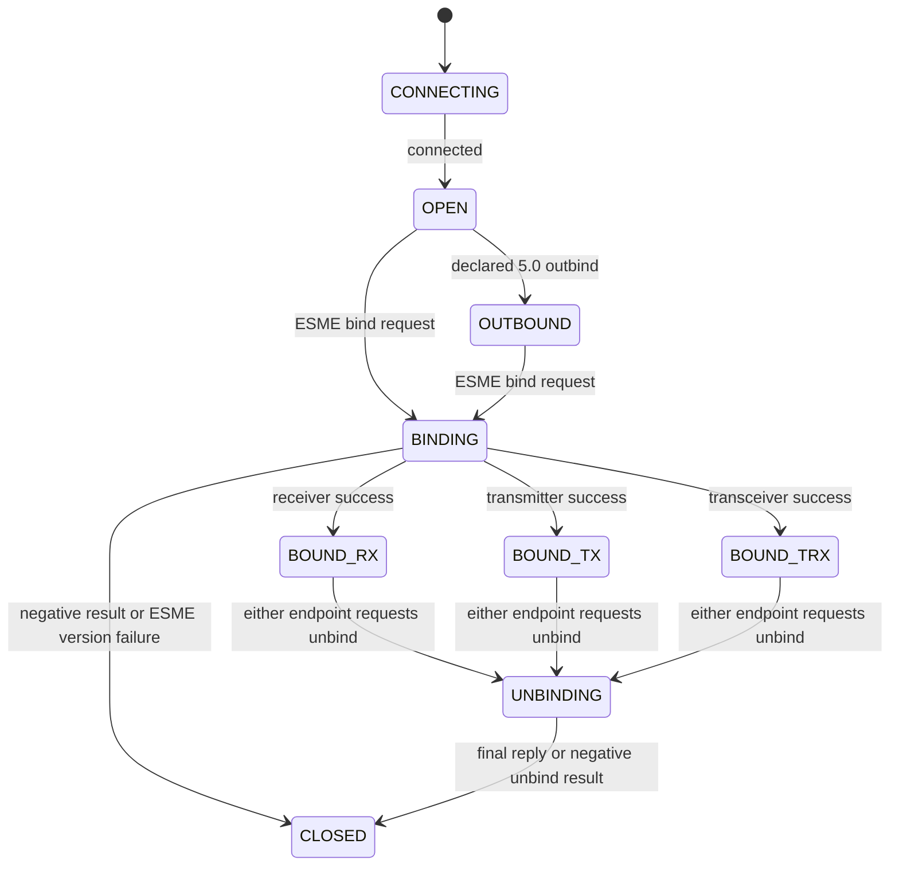

# Session state and permissions

Step 8 supplies deterministic protocol decisions for both ESME and message-center
endpoints under SMPP 3.4 and 5.0. The `kg.aidarbek.smpp.session` package depends
only on protocol values, profiles and JDK values. It creates no connection,
executor, timer, authentication callback, parser or application handler.

`SessionStateMachine` has one serialized owner. Opposite-direction protocol
activity may overlap, but callers must serialize method calls. Immutable version
results, requirement values and permission snapshots can be shared. A new
connection uses a new machine; a closed machine never reopens.

## Lifecycle

`close()` moves any state to CLOSED and is idempotent. It clears the fixed bind
and unbind identities without changing already produced immutable version
results. It owns no network resource and therefore does not implement a socket
cleanup or `AutoCloseable` contract.

The binding and unbinding states are library lifecycle overlays. Successful bind
responses choose one of the three bound modes. An ESME is always the bind-request
originator, independent of TCP connection direction. A 3.4 outbind notification
leaves the connection OPEN; the 5.0 model uses OUTBOUND. This notification model
does not implement the later outbind codec, connector or listener.
[SMPP 3.4 §§2.2–2.3](https://smpp.org/SMPP_v3_4_Issue1_2.pdf),
[SMPP 5.0 §§2.3–2.4](https://smpp.org/SMPP_v5.pdf).

An accepted outbound event authorizes the caller's next ordered write. When an
accepted bind/unbind response enters CLOSED, the caller still transmits that
final response and finishes its bounded flush before closing the connection.
A write failure calls `close()`. State acceptance neither schedules a write nor
proves transmission. Transport completion, deadlines and pending-request cleanup
belong to the later owning layers.

## Entry points and outcomes

| Entry point | Responsibility |
| --- | --- |
| `esme(requestedVersion, requireAdvertisement, implementedRequests)` | Keep the explicit ESME requirement and advertisement policy. |
| `messageCenter(acceptedVersions, advertisedVersion, implementedRequests)` | Keep the accepted client versions separate from the server's implemented advertisement. |
| `connected()` | Record connection establishment once. |
| `bindRequest(direction, mode, rawVersion, sequence)` | Record one ESME bind after field validation. |
| `bindResponse(direction, header, advertisement)` | Match the fixed bind request and apply its wire and version outcomes. |
| `requestPermission(direction, commandId, requirements)` | Query implementation, state, role and outgoing feature permission without mutation. |
| `availableRequests(direction, requirements)` | Obtain an immutable snapshot of those currently allowed request IDs. |
| `request(direction, header, requirements)` | Record an ordinary request, unbind or declared outbind; bind uses its metadata method. |
| `unbindResponse(direction, header, requirements)` | Check outgoing fields and complete one of the two possible directional unbind exchanges. |
| `responsePermission(direction, header, context, requirements)` | Check an ordinary response using externally established correlation. |
| `protocolErrorPermission(direction, header, offending, requirements)` | Check a negative reply to an offending request, without admitting it. |
| `close()` | End the logical lifecycle immediately and idempotently. |

`PduDirection` is relative to the machine owner. `EndpointRole` is the SMPP role,
not TCP client/server identity. `SessionDecision` is a policy result, not a wire
status. Invalid state, direction, unsupported implementation, unavailable
features and unexpected responses leave the lifecycle unchanged. Null or
structurally invalid API arguments throw before any mutation. Request sequences
must be 1 through `0x7fffffff`; allocation and reuse prevention are outside this
step. Unknown numeric response statuses remain available in the caller's header.

Duplicate bind requests never replace the original pending identity. Wrong bind
command, sequence or response direction is rejected atomically; the correct
response can still complete afterward. A matching negative bind response or
nonzero-status `generic_nack` closes. A message center refuses a proposed
successful response whose advertisement differs from its configuration, or whose
received version was not accepted; it remains BINDING so the caller can issue
the appropriate negative bind response. No authentication takes place here.

## Version and field requirements

`VersionNegotiation` preserves requested and advertised octets separately from
its optional effective profile. The ESME policy implements the [API table](API.md):

| Request / advertisement | Effective result |
| --- | --- |
| 3.4 / 3.4 or 5.0 | VERIFIED 3.4; no 5.0 operations or field features. |
| 5.0 / 5.0 | VERIFIED 5.0, still subject to implementation and bind permission. |
| 5.0 / 3.4 | PEER_VERSION_TOO_OLD; close the ESME lifecycle. |
| Either / missing | COMMON_WITHOUT_TLVS using common 3.4-compatible operations and fields; retain the requested octet. |
| Either / missing with strict policy | ADVERTISEMENT_REQUIRED; close. |
| Either / any other octet | UNSUPPORTED_PEER_VERSION; retain the raw advertisement and close. |

The message-center policy accepts an explicit nonempty set and an advertisement
at least as new as every accepted version. A received version outside that set,
including an unknown octet, produces REQUESTED_VERSION_NOT_ACCEPTED. A server
advertising 5.0 may accept a 3.4 request, whose effective semantics remain 3.4.
The result is a version decision, never an authentication decision.

`SendRequirements(minimumVersion, usesOptionalParameters)` describes the actual
outgoing field values as determined by command validation. In the missing-
advertisement result, a common command still cannot send a TLV or a 5.0-only
field value. Command identity alone is insufficient. Incoming raw extensions
remain subject to codec preservation/ignore rules and do not enable outgoing
features. Incoming state checks therefore ignore the non-null send-requirement
argument; codecs still validate field structure and supported semantics.

The missing-advertisement policy does not invent a mandatory payload rule for
`data_sm`. Its 3.4 wire layout lists `message_payload` among optional parameters.
An independently valid TLV-free `data_sm` can use the common profile; a send
containing a payload TLV is rejected in that restricted result.
[SMPP 3.4 §4.7.1](https://smpp.org/SMPP_v3_4_Issue1_2.pdf).
Missing advertisement provides no proof of full support; the restrictive default
follows the compatibility guidance and explicit library policy.
[SMPP 5.0 §2.11.2](https://smpp.org/SMPP_v5.pdf).

## Composing policies and codecs

Use the negotiated `effectiveProfile` for outgoing body validation/encoding.
The caller supplies accurate `SendRequirements` for actual fields: any TLV
requires optional-parameter support, while a 255-byte short message, predefined
message ID 255, or success-only receipt bits require 5.0. Encoding under a
profile and registering a codec do not themselves authorize a send. The state
package accepts these facts as values and never imports a codec.

`MessageDirection` means the original data request origin. Derive it from that
request, including when validating its response; `PduDirection` instead names
the local-relative direction of the current PDU. Keep both codec configurations
when handling data requests in both directions.

After body validation and external correlation, a concrete message response
can use `MessageResponseRules`. A matching `generic_nack` follows session response
authorization without that concrete message-body validator. Invalid offending
headers reach `protocolErrorPermission` as raw `PduHeader` values, because a
normal `Pdu` deliberately rejects their invalid envelope fields. The future
request owner must still prove generation, outstanding status and terminal
uniqueness; these composition rules create no general pending state.

## Exact operation permissions and honest capabilities

`SessionPermissions` answers the complete catalogue request table independently
of codecs or services. Its tests enumerate both profiles, both originating roles,
every modeled state and every defined request identity. The profile differences
are preserved:

- 3.4 `data_sm` permits both origins in TX, RX and TRX. Under 5.0, ESME data uses
  TX/TRX and message-center data uses RX/TRX.
- 3.4 `replace_sm` permits ESME TX only; 5.0 also permits TRX.
- Ordinary 3.4 enquiries require a bound session. Under 5.0 enquiries also work
  in OPEN, OUTBOUND, BINDING and UNBINDING; the latter two model pending protocol
  exchanges. No keepalive scheduler starts as a side effect.
- Responses are separate identities and are never admitted by the request table.

These distinctions come from the original operation matrices, including the
3.4 table's narrower replacement rule.
[SMPP 3.4 §2.3](https://smpp.org/SMPP_v3_4_Issue1_2.pdf),
[SMPP 5.0 §2.4](https://smpp.org/SMPP_v5.pdf).

The machine intersects those rules with explicitly declared implementation IDs
and outgoing version requirements. An implementation declaration covers both
processing directions and the operation's response. Endpoint composition must
supply actual supported operations. No universal sender interface or method
throwing an unsupported-operation stub is provided. A catalogue entry for query,
replacement, multiple submission or broadcast does not claim its codec or
application service exists. This step supplies permission queries, not live
sender capabilities. A retained snapshot must be rechecked for each new send.

## Responses, errors and simultaneous activity

Only the bind request and at most two unbind requests are correlated internally.
Ordinary submit/deliver/data/enquiry requests allocate no map entry, window slot,
sequence number, future or timer. Interleaved transceiver submission and delivery
using the same numeric sequence do not affect each other or change the bound
state.

`ResponseContext` contains the original header and its direction. Its caller
must already have matched the session generation, outstanding request and
terminal state. `responsePermission` verifies opposite direction, exact sequence
and expected response command, including a nonzero-status `generic_nack`. It
does not consume the context or protect it from reuse. An absent context denotes
an unsolicited, duplicate or late response and yields UNEXPECTED_RESPONSE. The
Step 9 request owner will supply and retire that context. This boundary avoids
claiming a general pending-request implementation in Step 8.

A caller that has established a protocol error uses `protocolErrorPermission`.
It permits a negative paired response to a known offending request, or a
negative generic nack to an unknown request, while the connection is active.
This includes a 3.4 submission before binding. The caller selects the appropriate
wire status, such as `ESME_RINVBNDSTS` (`0x4`) for an invalid bind state or
`ESME_RINVCMDID` (`0x3`) for an unknown command. Error context may retain sequence
zero or a high-bit value from an invalid original header. Such an unusable
sequence permits only a negative generic nack with response sequence zero;
high-bit reply sequences and paired responses with sequence zero are refused.
A usable original sequence must still be echoed exactly. A response can never
serve as the offending request, preventing nack loops. A completely undecodable
header cannot supply `ResponseContext`; the caller must not fabricate a request
identity if the command direction bit is unavailable. Unexpected responses do
not themselves authorize another protocol response.
[SMPP 3.4 §§3.3–3.4, 4.3, 5.1.3–5.1.4](https://smpp.org/SMPP_v3_4_Issue1_2.pdf),
[SMPP 5.0 §§2.8.2, 4.1.4, 4.7.24](https://smpp.org/SMPP_v5.pdf).

## Unbinding and closure

Either endpoint can begin unbinding from any bound mode. Admission of new
application requests stops immediately. Previously matched ordinary responses
may drain while UNBINDING. The response owner still supplies their correlation;
the state machine does not retain them.

One unbind per direction can overlap. Equal numeric sequences remain distinct.
For crossed successful unbinds, the first response clears only its own
direction; the second closes. A repeated response or replacement request in a
completed direction is rejected. A matching negative unbind result closes
immediately and never restores bound permissions. Explicit `close()` also clears
both directions, and later replies are rejected. These are deterministic library
shutdown policies applied to the request/response exchange.
[SMPP 3.4 §4.2](https://smpp.org/SMPP_v3_4_Issue1_2.pdf),
[SMPP 5.0 §§2.3.5–2.3.6, 4.1.1.8–4.1.1.9](https://smpp.org/SMPP_v5.pdf).

The [session review](reviews/0007-session-state.md) records TDD, source hashes and
all five SOLID principles for every new type. The separately owned
[architecture review](reviews/0007-session-architecture.md) records actual
dependency violation probes. Networking, general pending outcomes and deadlines
remain later roadmap steps.
